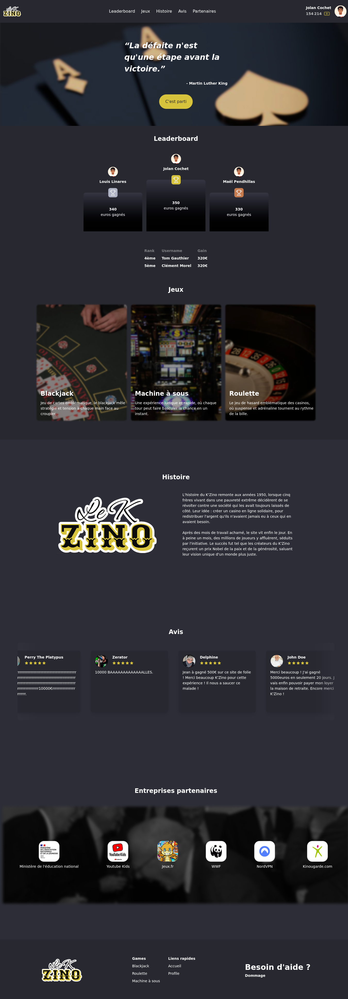
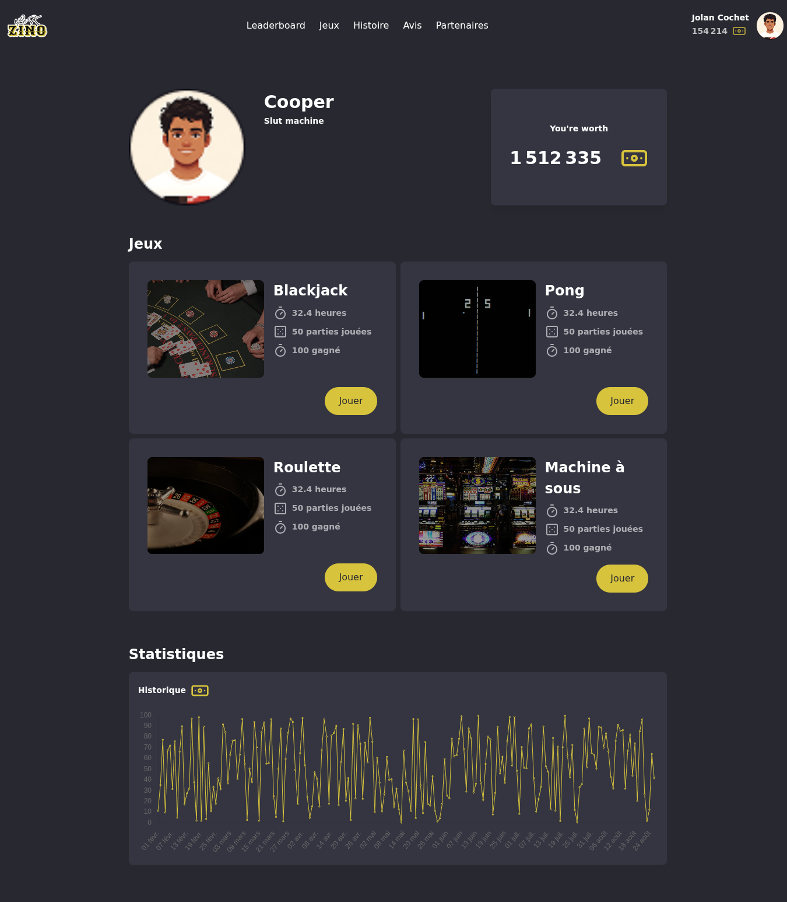

# Transcendance

Transcendance est un projet réalisé dans le cadre de l’école 42 à Angoulême. Il s’agit d’un projet web de groupe développé en Vanilla TypeScript, dont le thème était la recréation d’un casino en ligne.

## Stack

Frontend : Vanilla TS & TailwindCSS 
Backend : Fastify TS

Nous avions l'obligation de ne pas utiliser de framework (React, Vue, Angular, ...). Nous avons donc décider de recoder un framework from scratch pour avoir une bonne experience de développement tout au long du projet.
 
## Preview

### Landing page

### User's profile

